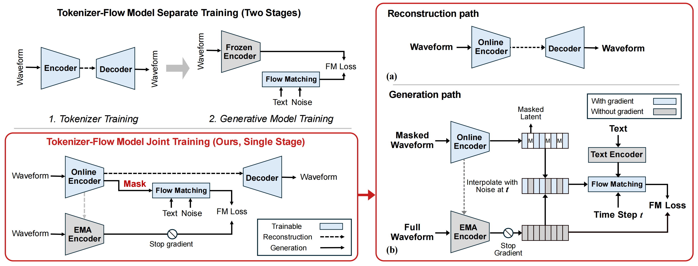

# **UNITE-AUDIO**: Joint learning of continuous tokenization and latent flow matching for text-to-audio generation

<p align="center">
  <a href="https://runwushi.github.io/Unite-Audio/"></a>
  <a href="https://arxiv.org/abs/2609.28206"></a>
  <a href="https://huggingface.co/RunwuShi/UNITE-AUDIO"></a>
</p>

<p align="center">
  
  <br />
  <strong>UNITE-AUDIO</strong> lets <mark>continuous tokenization</mark> and <mark>latent flow matching</mark> learn together through <mark>noisy partial-context prediction</mark>.
</p>

## Checkpoints

All checkpoints are available on [Hugging Face](https://huggingface.co/RunwuShi/UNITE-AUDIO).

| Checkpoint | Description |
| --- | --- |
| Stage 3 Flow Model | The shared text-conditioned latent flow model. |
| Default Decoder | The decoder checkpoint used for the reported paper metrics. |
| Spectral Decoder | An alternative decoder with more stable high-frequency detail. |

The default setting uses the Stage 3 Flow Model with the Spectral Decoder.

## Inference

Install the dependencies:

```bash
pip install -r requirements.txt
cd inference
```

Generate audio with the default setting:

```bash
python infer.py "Ocean waves crash against a rocky shore"
```

The default uses the Stage 3 Flow Model and Spectral Decoder. Available
devices, models, checkpoint definitions, and default sampling settings are all
listed in `config.json`. Command-line arguments override the configuration:

```bash
python infer.py "Ocean waves crash against a rocky shore" --device mps
python infer.py "Ocean waves crash against a rocky shore" --decoder default_decoder --steps 16
```

The required checkpoints download automatically from [Hugging Face](https://huggingface.co/RunwuShi/UNITE-AUDIO) on first use and are cached locally in `checkpoints/`.
