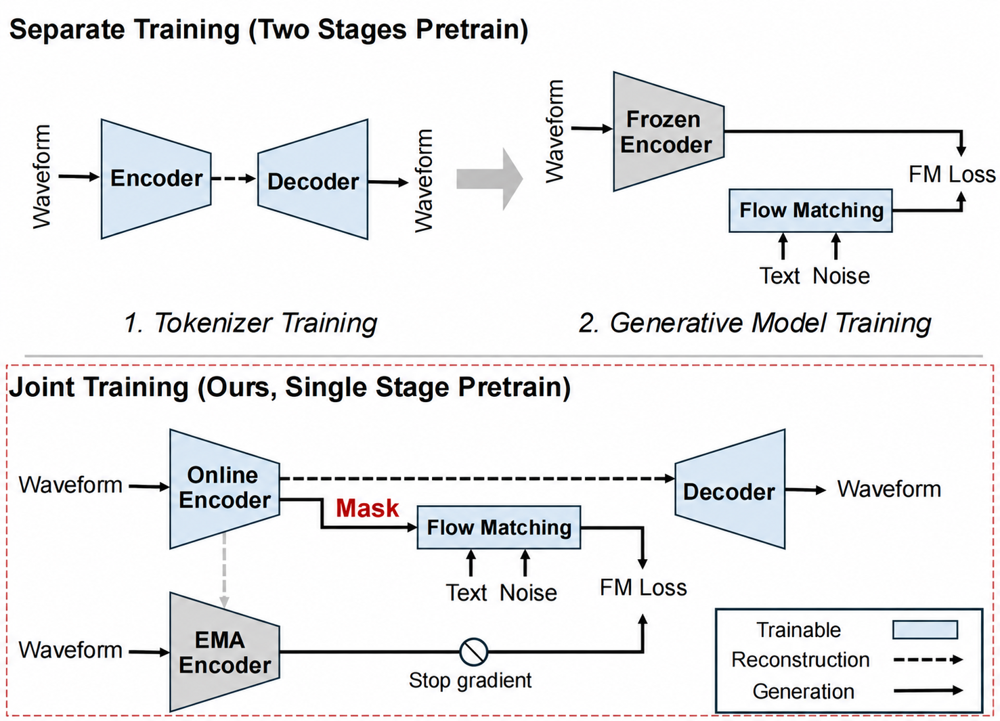
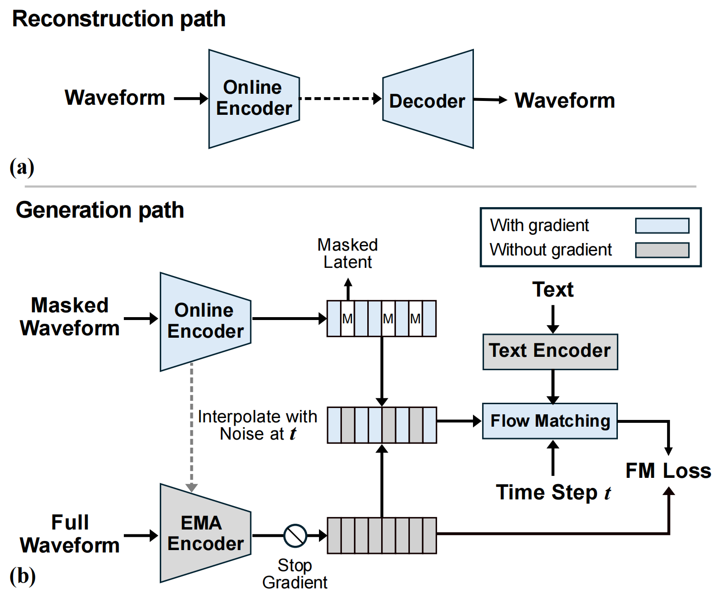

# UNITE-AUDIO

### Joint learning of continuous tokenization and latent flow matching for text-to-audio generation

[Project Page](https://runwushi.github.io/Unite-Audio/) ·
[arXiv](https://arxiv.org/abs/2609.28206) ·
Hugging Face (coming soon)

<p align="center">
  
  
</p>

## Inference

Install the dependencies:

```bash
pip install -r requirements.txt
cd inference
```

Generate audio with the default setting:

```bash
python infer.py "Ocean waves crash against a rocky shore"
```

The default uses the Stage 3 Flow Model and Spectral Decoder. Available
devices, models, checkpoint definitions, and default sampling settings are all
listed in `config.json`. Command-line arguments override the configuration:

```bash
python infer.py "Ocean waves crash against a rocky shore" --device mps
python infer.py "Ocean waves crash against a rocky shore" --decoder default_decoder --steps 16
```

Model weights will be released separately.
